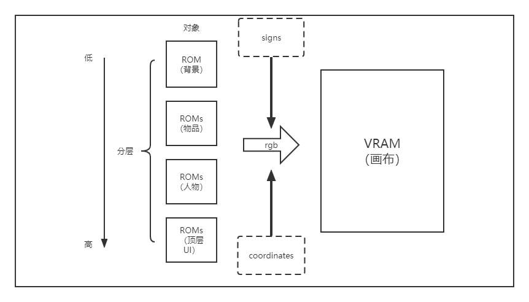
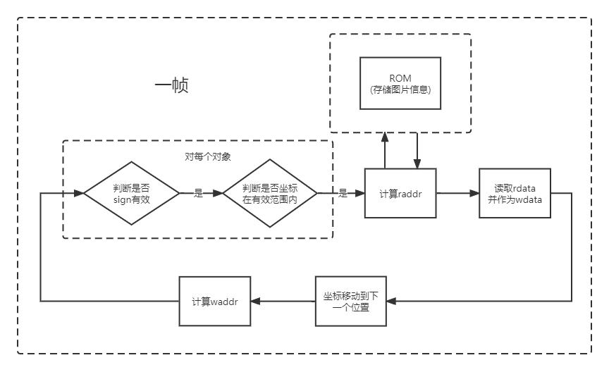

## Top 模块

顶层模块主要可以分为两个部分：显示控制模块与核心逻辑模块。  
核心逻辑模块主要由：Dinostate（决定游戏状态）、Collision Detection（游戏是否发生碰撞）构成。前者根据外部输入、碰撞检测等来改变游戏的整体状态。后者则是根据在显示控制模块中画布上是否发生障碍物与恐龙写入同一个像素点进行判断。核心逻辑模块决定了游戏整体的状态，同时也会影响显示控制模块的状态。

显示控制模块主要由：DrawDino、DrawObstacle、DrawGameRestart、DrawBGND四个部分组成。这四个模块分别从VGA中得到的行列像素坐标进行判断，决定当前像素点是恐龙，障碍物，重启UI，背景中的哪一种，并根据正确的覆盖逻辑由下至上在画布上进行绘制。

## 显示控制模块设计思路

对于每一个需要显示的动画单元,由坐标，大小，初始位置，显示状态等属性构成。在每一帧扫描的过程当中，动画单元首先进行状态判断是否进行位移，位移完成后变可以计算当前的坐标，并从VGA中读取当前行列像素坐标，判断该坐标是否被当前动画单元所覆盖，是否有效，并根据对应的坐标计算RGB数据在ROM的位置（由于使用IP核Distributed Memory，并没有行列译码器，需要自己手动计算），从ROM读取数据后交给画布绘制部分进行判断。

动画单元的移动完全由修改动画单元的坐标来实现,而具体的移动方式则可以通过速度，状态机，修改坐标进行控制。

但部分资源素材，例如游戏中的仙人掌等需要动态生成的部分，要在编译时确定。因此，我们不能真正地实现动态的创建,而是通过同一动画单元改变其显示状态和查询的ROM来实现类型的切换；同时设置一个有效值，当且仅当有效值为1的时候进行显示。这样，我们可以不断重置该资源的坐标与现实状态来实现不断动态生成的效果。

## VGA的透明显示

在游戏素材中的所有文件都是有PNG构成，而PNG图片是具有透明度alpha的；但在VGA显示中仅有RGB通道，故无法完全实现透明度效果。

但我们可以根据图像的分层来实现这一效果，即当该图层透明度为0时不显示该图层，改为显示下一图层来实现这一目标。在PNG转储COE文件时我们同样保留了alpha通道以能够更好地进行判断。故在ROM中存储的数据共有16位，高12位分别为RGB信号，低四位为原图中的透明度。

## 碰撞检测
在我们的设计中，碰撞检测是在画布的检测中进行的。因为画布完整的记录了游戏中各个动画单元的状态信息和坐标信息。当两个像素点在同一个坐标中有效时，我们就可以认为发生了碰撞。

## 各模块详细说明

### DrawBGND

DrawBGND是控制背景地面显示的模块。在BGND模块中，我们传出了两个信号，`isemptyBGND`,与`rgb_BGND`；前者表明在该次扫描中xx与yy对应像素点是否包含在背景显示的范围中，后者是当包含在背景显示中的具体RGB信号。与其他显示控制模块不同的是，背景地面的显示宽度是固定的，所以我们需要再背景图片资源（2400宽的图片）中来设置坐标`pos1`与`pos2`。`pos1`与`pos2`分别在原图中显示的区域，pos2与pos1始终相距一个屏幕宽度的距离。在每一个bgnclk的周期中，`pos1`与`pos2`分别向前移动一个像素。对于VGA传入的像素坐标，我们进需要判断它的y值是否有效，因为x值是一定始终有效的。代码中的accurateY即为判断是否有效的信号。根据`pos1`与`pos2`和VGA给出的x与y信号，我们计算其对应在ROM中的具体位置。

在最终的输出中，我们还需要进行是否有效的判断，即判断其透明度和坐标合法性，从而得到`isemptyBGND`。

### DrawDino

DrawDino是控制小恐龙显示的模块。在DrawDino中，我们同样传出了两个信号，`isemptyDino`,与`rgb_Dino`；前者表明在该次扫描中xx与yy对应像素点是否包含在背景显示的范围中，后者是当包含在背景显示中的具体RGB信号。输入信号jump、lying分别表示是否跳跃与蹲下。在参数设置中，`initialV`与`Grav`分别表示初速度与重力加速度。

在该模块中位置的显示控制与动画的显示控制是分开的：

我们首先维护一个小恐龙的X与Y坐标。默认状态下坐标处于初始状态，每当一帧刷新时我们进行判断：当Jump键按下时，小恐龙进行跳跃，我们给小恐龙的速度赋值为initailV,此时更改为跳跃状态;当已经处于跳跃状态，不再接受新的跳跃信号，我们在小恐龙的速度中减去一个单位的重力加速度；当小恐龙Y坐标重新回到地面时，跳跃状态结束，我们重新接受跳跃信号，小恐龙速度归零。

动画的显示控制由两个子模块AnimateFSM与DinoJudge分别进行，前者对动画的类型进行控制，后者对恐龙的画布具体显示进行控制。动画的类型根据输入和Animateclk进行切换，而后者根据当前的小恐龙动画类型在不同的ROM中进行选择。

### DrawObstacle

DrawObstacle是控制障碍物显示的模块。在DrawDino中，我们同样传出了两个信号，`isemptyObstacle`,与`rgb_Obstacle`；前者表明在该次扫描中xx与yy对应像素点是否包含在背景显示的范围中，后者是当包含在背景显示中的具体RGB信号。

在这个模块中，主要涉及3个部分：位置的显示控制、动画的显示控制、障碍物的生成

位置的显示控制与默认的显示控制是一致的，我们维护一个ObstacleX与ObstacleY来分别决定障碍物的显示坐标（其中鸟将增加一个偏移量BirdOffset），当障碍物已经生成时，在每个backgound时钟周期内，障碍物的X值将会自减。

动画的显示控制在两个子模块ObstacleFSM与ObstacleJudge分别进行；前者对动画的类型进行控制，后者对障碍物的画布具体显示进行控制。动画的类型根据输入和Animateclk进行切换，而后者根据当前的障碍物类型在不同的ROM中进行选择。

在障碍物的生成中，当且仅当两种条件满足时进行生成：
+ 当前画布中没有障碍物
+ 当前obsclk为真

这是为了保证画布中的障碍物不会过于密集，并且便于难度设置与调整。

在障碍物类型控制中，由于实际上板无法生成真正的随机数，故我们只能生成一个有限状态机在不同的障碍物之间进行切换操作。并且实际上的生成也是切换状态并重置坐标至屏幕右方来进行的。

### DrawGameRestart

此处的UI显示为完全静态的显示，与前部分动画单元的控制完全相同，仅仅只需要根据游戏当前的状态进行对应的切换即可。